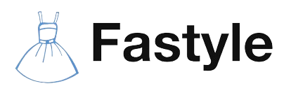

<p align="center">
    <br>
    
    <br>
<p>
<div style="display: flex; align-items: center; justify-content: center; color:#00B14F; font-weight: bold; font-size: 150%; margin-left: 20px;">
  
  <span>Bootcamp Internship Programming</span>
</div>

---

# Welcome to  <span style="color:rgb(13, 180, 185)">Fast</span>yle

## [Introduction](https://www.youtube.com/watch?v=701Ou8BI4JQ)
---

### To do task
- [x] [Landing Page]()
- [x] [Search clothes by text]()
- [x] [Outfit recommendation from input]()
- [x] [Try on AI with Generative AI]()
- [x] [Try on manually]()
- [x] [Suggest other shop]()

## Installation
---

#### [Python services]((services/README.md)) - Please read this [README](services/README.md) file carefully before performing the following steps.

#### [GenAI services]((backend/README.md)) - Please read this [README](backend/README.md) file carefully before performing the following steps.


## Architecture
---


## Quickstart

---

### Front-end <p align="center">
  <a href="https://skillicons.dev">
    
  </a>
</p>

### `npm run build`

Builds the app for production to the `build` folder.\
It correctly bundles React in production mode and optimizes the build for the best performance.

The build is minified and the filenames include the hashes.\
Your app is ready to be deployed!

See the section about [deployment](https://nextjs.org/docs/pages/building-your-application/deploying) for more information.

### `npm run start`

Runs the app in the development mode.\
Open [http://localhost:3000](http://localhost:3000) to view it in your browser.

The page will reload when you make changes.\
You may also see any lint errors in the console.

---

### Backend <p align="center">
  <a href="https://skillicons.dev">
    
  </a>
</p>

  Install dependencies:

```console
$ cd backend
$ npm install
```

  Create the app:

```console
$ npm run build
```
  Start the server:

```console
$ npm start
```

  View the website at: http://localhost:4000

### Python services <p align="center">
  <a href="https://skillicons.dev">
    
  </a> 
    
    
    

</p>

 
  Check the directory

```console
$ cd ..
$ ls
backend  frontend  services  fastyle-grab  Dockerfile ......
```

  Build docker container:

```console
$ docker compose -p fastyle-grab up -d
```
  Start the server:

```console
$ docker compose up
```

## Video demo

<span style="color:green; font-weight: bold; font-size: 120%;">Update soon ...</span>