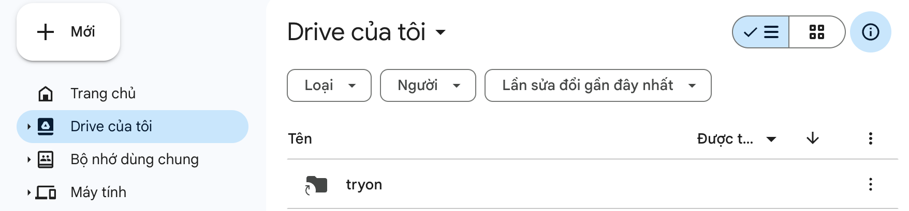

# Try on clothes with Generative AI

## Mount cloud storage into My Drive

Truy cập vào folder **[tryon](https://drive.google.com/drive/folders/1IYTIfWwyi6eouUjI5SZ_2r1_J3NGmufl?usp=drive_link)**, sau đó thêm lối tắt vào **Drive của tôi**

Drive của tôi sẽ như sau: 

## Đăng ký tài khoản vào Ngrox 

## File colab chạy
Truy cập vào [Generative AI Backend](https://colab.research.google.com/drive/1ndlApUVT23Wwed936Vc6o0sZyAD3ys_0?usp=sharing) và sửa **ngrox token**
